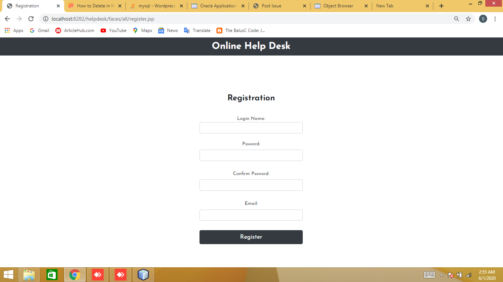
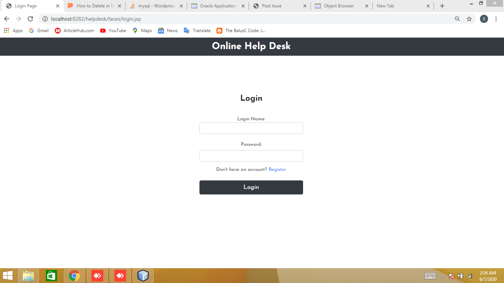
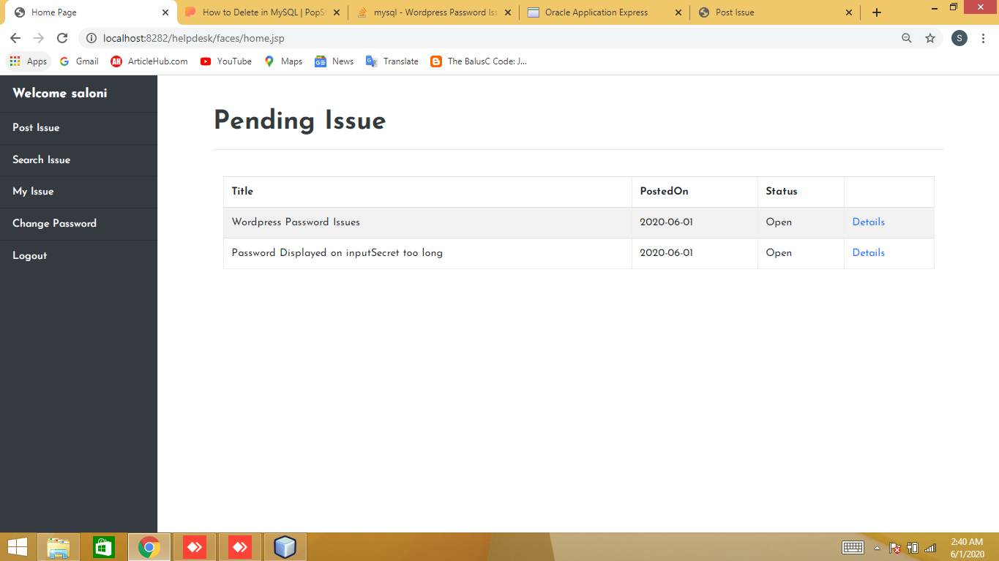
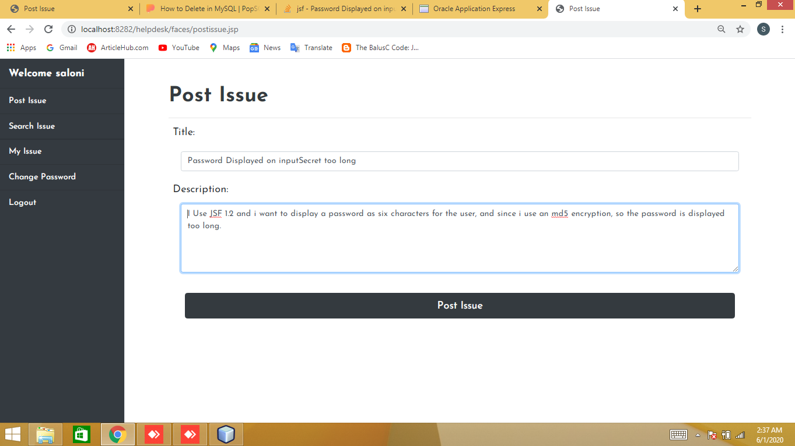
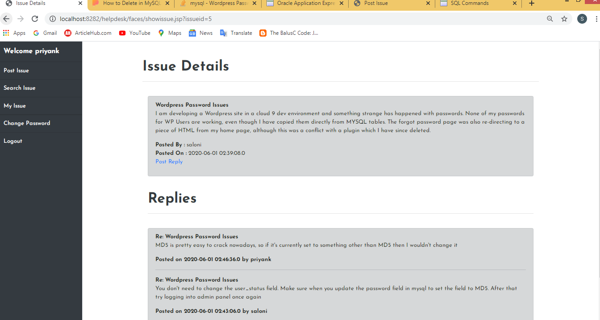
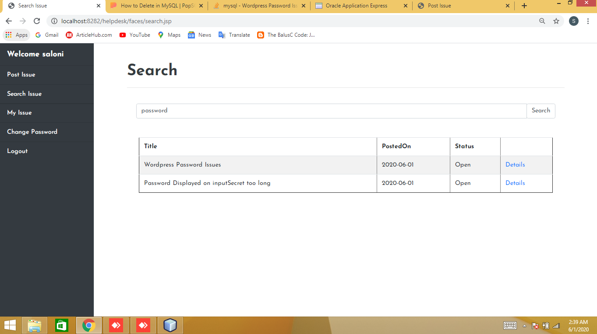
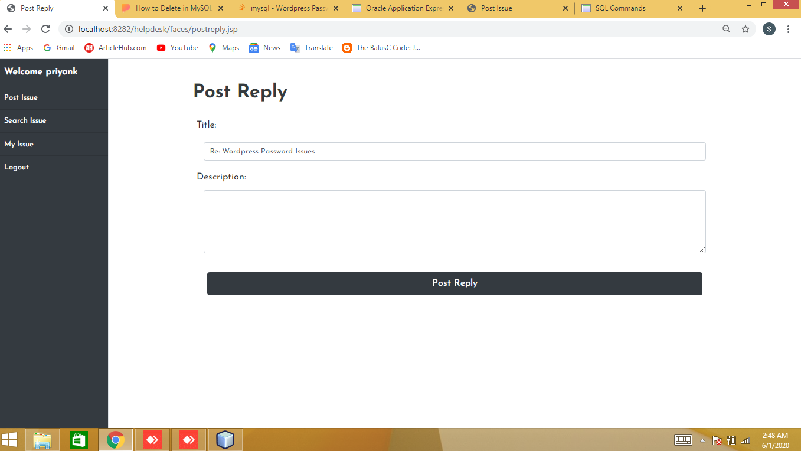
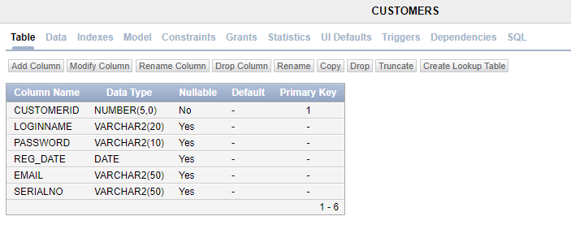
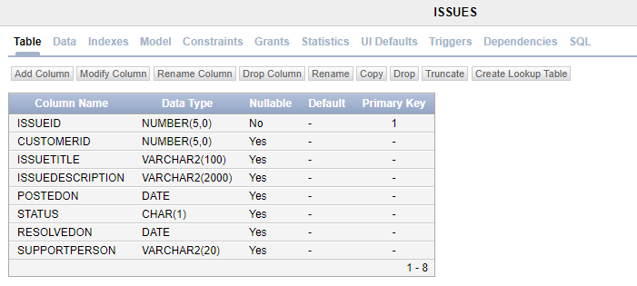
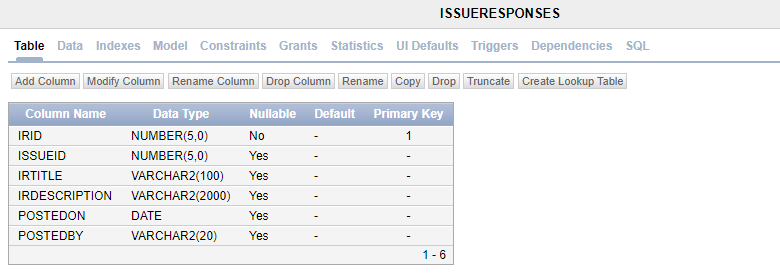

# Helpdesk

### Working Demo
https://user-images.githubusercontent.com/37000199/149259600-dac536d2-a616-408e-8c3f-5bc1ea932bcc.mp4

#### Register user account

</img>

#### Login user account
</img>

#### Display pending issues posted by the user
</img>

#### Post an issue
</img>

#### Display an issue and replies 
</img>

#### Post an issue
</img>

#### Ssearch an issue
</img>

#### Reply an issue
</img>

#### Oracle Database
##### CUSTOMER TABLE
</img>
##### ISSUES TABLE
</img>
##### ISSUE_RESPONSES TABLE
</img>
